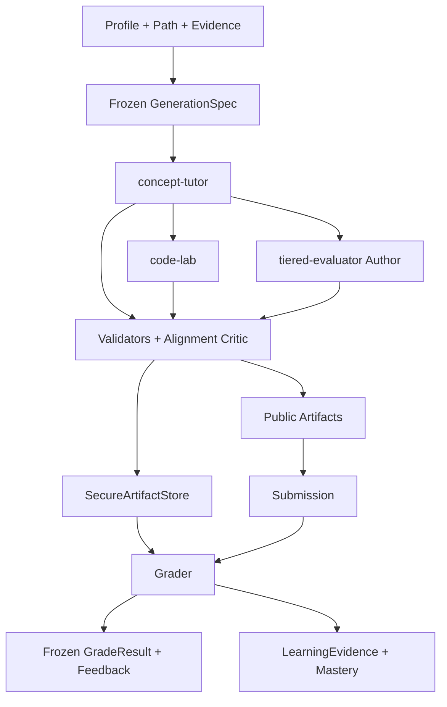

# Role C 设计说明

| 项目 | 内容 |
|---|---|
| 设计版本 | 2.4 |
| Schema 版本 | 1.0 |
| Prompt manifest | `c-prompts-1.7.0` |
| 实现目录 | `src/role-c-content/` |
| Schema 目录 | `schemas/role-c-content/` |
| 自动检查 | `bun run check` |
| 完整演示 | `bun run demo:role-c:full` |

## 1. 职责

Role C 将版本化画像、学习路径和 RAG 证据编译为相互对齐的讲义、代码实验、分层测评、评分反馈和学习证据。

- 输入：`LearnerProfileSnapshot`、`LearningPathNode`、`RagEvidencePack`、`SessionState`、`SubmissionEnvelope`。
- 公开输出：讲义、实验题面、测评题面、冻结成绩、学习证据、画像漂移建议和审计事件。
- 安全输出：参考实现、隐藏测试、答案规范、评分组和误区映射。
- 控制输出：证据缺口请求与事实冲突审计包。

画像、路径和证据均作为只读版本化输入。模型生成 Draft；确定性程序负责 Schema、证据接地、答案、执行、安全和发布状态。

## 2. 设计原则

### 2.1 Locked Core 与 Adaptive Shell

- Locked Core：事实、目标、先修关系、代码语义、答案、评分规则和安全策略。
- Adaptive Shell：解释顺序、案例语境、阅读密度、提示层级和脚手架。

个性化只作用于 Adaptive Shell。所有事实 Claim 均绑定当前证据中的 `source_id/fact_id`。

### 2.2 固定流水线



三个 Agent 共用同一份递归冻结的 `GenerationSpec`。运行状态为 `PLANNED → GENERATING → VALIDATING → READY/BLOCKED/FAILED`。

## 3. 输入合同

| 契约 | 关键语义 |
|---|---|
| `LearnerProfileSnapshot` | 水平、已知/薄弱概念、场景偏好、阅读密度、脚手架需求 |
| `LearningPathNode` | 目标、必要事实、先修、可观察行为、`assessment_blueprint` |
| `RagEvidencePack` | 整包匹配状态、来源、事实、示例、练习与题目种子 |
| `GenerationSpec` | 冻结后的目标、难度、策略、版本、seed 与模型配置哈希 |
| `SubmissionEnvelope` | run/form/learner、作答、attempt 与提示状态 |

`buildGenerationSpec` 执行以下校验：

1. ID 唯一性、目标与先修集合、画像已知/薄弱集合；
2. 难度、题量、权重和资源限制范围；
3. 目标 source、required fact 和生成材料完整性；
4. `assessment_blueprint` 题量、题型与核心目标覆盖能力；
5. 事实 ID 的内容一致性。

RAG 整包 `match_status` 作为检索质量结论。目标证据与生成材料另按内容完整性校验。事实冲突生成 `FactAuditPacket`；材料缺失生成 `EvidenceGapRequest`。

## 4. 三个 Agent

### 4.1 concept-tutor

生成先修桥梁、概念解释、工作示例、误区、micro-check、三级提示、总结和 objective-to-block 映射。

验证要求：

- 每个核心目标包含解释、示例或即时检查、误区和三级提示；
- 每个 Claim 引用有效 `source_id/fact_id`；
- Claim 仅接受 Unicode、大小写、空白、标点和短语白名单内的等价归一化；
- 引用清单与正文实际使用情况一致；
- 先修桥梁覆盖 evidence pack 中实际返回的先修证据。

### 4.2 code-lab

Public 产物包含任务、执行合同、starter、公开测试、提示和反思；Secure 产物包含参考实现、隐藏测试、评分组、误区映射和 mutation variants。

`TrustedCodeLabVerifier` 验证：

- public/secure 的 `lab_id`、执行合同和目标映射一致；
- reference 通过全部测试；
- starter 保留待完成行为；
- 每个典型错误变体被指定测试识别；
- 公开产物通过字段名与内容值泄漏检查。

基础运行语言为 Python。题目 `allowed_imports` 与平台标准库白名单取交集。OCI runner 使用 digest-pinned 镜像、无网络、只读 root、非 root 用户和受限 CPU、内存、PIDs、时间、输出与 tmpfs。

### 4.3 tiered-evaluator

Author 按 `assessment_blueprint` 生成 Tier 1/2/3 测评。每题包含稳定 `family_id/variant_id/item_id`、objective、tier、modality、citation、evidence weight 和误区映射。

支持以下答案规范：

- exact-set：选项、判断和规范化短答案；
- numeric：数值、容差和单位；
- code：隔离 runner 与 secure test suite；
- concept-rubric：逐 criterion 盲审。

Grader 先校验提交边界，再执行确定性评分或逐标准盲审。`uncertain` 或加权置信度低于 `0.65` 时返回 `needs_review`。总分由程序聚合。

Feedback 只读取冻结后的公开评分结果，输出错误定位、误区和下一步练习建议。

## 5. 分阶段生成

默认 Provider 使用 staged 模式：

| Agent | 阶段 |
|---|---|
| concept-tutor | 按目标组生成片段，再按目标顺序确定性聚合 |
| code-lab | 生成并冻结 public，再生成 secure |
| tiered-evaluator | 程序冻结 item plan，依次生成 public 与 secure |

程序生成稳定 ID、覆盖索引、引用清单、测试权重、评分组、路由和选项位置。每个阶段先通过局部门禁，组合结果再通过完整 Schema、语义、安全和独立 verifier。

concept 支持有界并发和稳定顺序，默认 `concept_concurrency=1`。code-lab 与 assessment 的 public → secure 链保持顺序执行。

## 6. 信任与安全

- D 端接收 public artifacts 与 `secure://role-c/v1/...` opaque ref。
- `SecureArtifactStore` 对 pipeline、grader、admin 执行 principal、run 和完整性校验。
- Prompt 与证据数据分离；证据文本按不可信输入处理。
- 模型只生成候选内容和局部判断，不填写质量指标、总分或发布状态。
- Python 静态分析与容器内 AST 执行同一平台 import 策略。
- runner 基础设施错误与学习者失败分别记录。
- secure artifacts 在最终门禁通过后原子批量写入。

## 7. 对齐与修订

跨产物门禁检查：

- objective → 讲义 block；
- objective → 实验 instruction、public test、hidden test；
- objective → assessment item、AnswerSpec；
- 可观察行为与题型；
- 讲授、练习和测评的一致性；
- public/secure 合同与稳定答案 ID。

Alignment Critic 输出 `AlignmentObjection[]`。首次 critical objection 触发一次定向修订；复验仍存在 critical objection 时产物进入 `BLOCKED_ALIGNMENT_FAILURE`。

## 8. 学习证据与掌握度

完成边界验证且全部题目达到 `graded` 状态后生成 `LearningEvidenceEvent`。证据分数综合 raw ratio、题目权重、grader confidence、提示级别和重复曝光。

多题先按 objective 与 grade artifact 聚合，再更新 Beta 状态。初始状态为 `Beta(1,1)`；grade artifact ID 保证重放幂等。迟滞阈值控制 remediate、reinforce 和 advance，已观察 modality 参与动作判断。持续画像冲突生成 `ProfileDriftSuggestion`。

## 9. 可靠性与审计

- 网络、超时、429 和 5xx 使用有限传输重试；
- 每个 Author 阶段最多一次定向格式修复；
- runner 只对 infrastructure error 使用有限工具重试；
- 跨产物语义修订最多一次；
- 缓存键覆盖完整 Spec、evidence、Prompt、模型配置和 seed 的 canonical SHA-256；
- checkpoint 保存 concept 与两条 secure 分支的内部结果；
- trace 使用 append-only sequence，记录阶段、耗时、尝试、修订、验证摘要和版本。

## 10. 接口与运行

Canonical 入口为 `runCPipeline → RoleCContentProvider → validators`。TypeScript 与 OpenCode worker adapter 使用同一 Draft 和 Artifact 合同。

```bash
bun run check
bun run demo:role-c
bun run demo:role-c:lab
bun run demo:role-c:full
bun run smoke:role-c:model
```

真实模型配置位于 Git 忽略的 `.env.role-c.local`。OCI 验收通过 `ROLE_C_RUNNER_RUNTIME`、`ROLE_C_RUNNER_IMAGE` 和 `bun run demo:role-c:lab:oci` 执行。

## 11. 验收基线

- 全部 runtime JSON Schema 通过；
- 核心 objective 覆盖率为 100%；
- 非法引用、unsupported core claim、答案泄漏和 public/secure 内容泄漏为 0；
- 客观题评分确定且可复现；
- reference 全通过、starter 保留待完成行为、mutation 达到声明阈值；
- 同一冻结成绩的学习证据与掌握度更新保持幂等；
- blocked、failed、retry、revision、checkpoint 和 cache 路径均有自动测试。

当前自动基线：130 项测试、984 个断言、三个确定性 Demo、三个真实模型 Author 冒烟路径。
