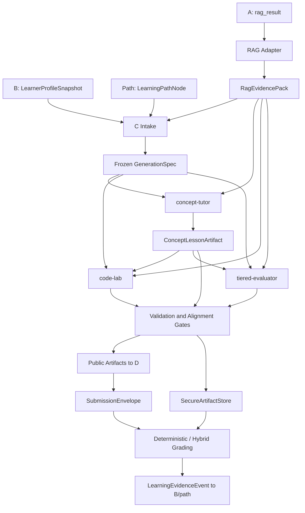

# Role C 设计稿：证据约束的个性化教学内容系统

| 项目 | 内容 |
|---|---|
| 文档状态 | 正式设计稿 |
| 设计版本 | 1.0 |
| 对应实现 | `src/role-c-content/` |
| 对外 Schema | `schemas/role-c-content/` |
| 联调样例 | `examples/role-c-content/` |
| 当前阶段 | 外围框架已完成，生成、执行与持久化服务待接入 |

## 1. 文档目的与状态说明

本文档定义 Role C 的系统边界、核心数据结构、三个 Agent 的职责、内容生成流程、安全边界、评分与学习证据机制，同时记录当前实现状态。

状态标记含义如下：

| 状态 | 含义 |
|---|---|
| **已完成** | 类型、核心逻辑和测试已存在，当前可用 |
| **基础实现** | 主要流程已可运行，仍需要产品化、校准或增强 |
| **接口已预留** | 边界已稳定，具体服务尚未接入 |
| **待实现** | 设计已确定，当前代码尚未覆盖 |

## 2. 系统目标与范围

Role C 将学习者画像、学习路径与 RAG 证据编译为一组相互对齐的教学产物：

1. 个性化概念讲义；
2. 可执行的代码实验；
3. 分层测评与可追溯评分；
4. 反馈给画像与路径系统的学习证据。

整体形态可概括为“证据约束教学编译器”（Evidence-Constrained Instructional Compiler, ECIC）：生成式模型负责内容表达，确定性模块负责证据、结构、答案、执行和发布边界。

### 2.1 设计范围

- A/B/D 的直接 TypeScript 与 JSON 数据契约；
- `GenerationSpec` 的确定性构建；
- `concept-tutor`、`code-lab`、`tiered-evaluator` 三个 Agent；
- public/secure 产物隔离；
- 证据、引用、泄漏、对齐和执行门禁；
- 提交、评分、学习证据与下一步决策；
- 状态机、追踪事件、版本与可复现性信息。

### 2.2 非目标

- Role C 不负责初始学习者画像的采集与合成；
- Role C 不负责知识库的编辑与检索排序；
- Role C 不负责前端样式与任意 HTML 生成；
- Role C 不在主 Bun/OpenCode 进程中执行学习者代码；
- 当前阶段不包含 HTTP、MCP 等远程传输层，先以直接 TypeScript 调用固化契约。

## 3. 核心设计原则

### 3.1 Locked Core + Adaptive Shell

教学产物被划分为两类属性：

| 区域 | 内容 | 是否可个性化 |
|---|---|---|
| Locked Core | 专业事实、学习目标、先修关系、代码语义、答案、评分标准、安全策略 | 否 |
| Adaptive Shell | 表达方式、案例背景、内容顺序、阅读密度、提示级别、脚手架强度 | 是 |

该分层保证个性化不会改变教学事实与评分口径。

### 3.2 证据先于生成

所有事实性内容均来自当前 `RagEvidencePack`，并通过 `source_id + fact_id` 引用。RAG 结果分为：

- `strong`：可进入生成流水线；
- `weak`：返回 `EvidenceGapRequest`，当前不发布事实性产物；
- `no_match`：返回 `EvidenceGapRequest`，等待重新检索或补充知识。

初始 query 由画像/编排链路构建；Role C 消费检索结果，并在证据不足时通过 `EvidenceRefreshPort` 表达补充需求。

### 3.3 生成与验证分离

Agent 不直接决定产物能否发布。生成结果还需经过确定性形状检查、引用检查、泄漏检查、执行/答案验证与跨产物对齐检查。

### 3.4 创作平面与信任平面分离

- 创作平面：Prompt、模型与 Agent Provider；
- 信任平面：Schema、证据、答案、隐藏测试、代码执行器、状态机与持久化。

两者通过 `RoleCContentProvider`、`ModelGateway`、`CodeRunner` 和 `SecureArtifactStore` 等端口解耦。

## 4. 系统架构



### 4.1 组件与实现状态

| 组件 | 职责 | 状态 | 位置 |
|---|---|---|---|
| Profile Adapter | 将 B 现有画像转为版本化快照 | **已完成** | `contracts/profile-adapter.ts` |
| RAG Adapter | 将 A 当前 `rag_result` 归一化为 `RagEvidencePack` | **已完成** | `contracts/evidence-pack.ts` |
| Spec Builder | 校验入口并构建 `GenerationSpec` | **已完成** | `contracts/generation-spec.ts` |
| Agent Shells | 三个 Agent 的请求、产物和 Provider 边界 | **已完成** | `agents/` |
| Content Pipeline | 生成、校验、安全存储和 trace | **已完成** | `orchestrator/` |
| Validators | 证据、引用、泄漏和对齐检查 | **基础实现** | `validators/` |
| Grading | 精确值、数值、代码与主观题评分调度 | **基础实现** | `grading/` |
| Mastery | 生成学习证据和下一步决策 | **基础实现** | `mastery/` |
| Model Provider | 将 Prompt/模型输出转为结构化 Draft | **接口已预留** | `RoleCContentProvider` |
| Isolated Runner | 无网络隔离执行学习者代码 | **接口已预留** | `CodeRunner` |
| Secure Store | 保存答案、参考解和隐藏测试 | **接口已预留** | `SecureArtifactStore` |

## 5. 核心数据契约

线上 JSON 统一使用 `snake_case`，当前 Schema 版本为 `1.0`。TypeScript 类型由 `src/role-c-content/contracts/index.ts` 统一导出。

### 5.1 对外消息

| 方向 | 消息 | 作用 | 状态 |
|---|---|---|---|
| A → C | `RagEvidencePack` | 规范化的事实、示例、练习与题目种子 | **已完成** |
| C → A | `EvidenceGapRequest` | 表达缺失知识、事实或强匹配需求 | **已完成** |
| C → A | `FactAuditPacket` | 表达引用冲突或支撑不足 | **接口已预留** |
| B → C | `LearnerProfileSnapshot` | 带版本的学习者画像快照 | **已完成** |
| Path → C | `LearningPathNode` | 当前目标、先修知识与可观察行为 | **已完成** |
| C → B/Path | `LearningEvidenceEvent` | 按目标返回评分证据与行动建议 | **基础实现** |
| C → B/Path | `ProfileDriftSuggestion` | 表达画像与持续客观证据的偏移 | **接口已预留** |
| D → C | `SessionState` | 会话、尝试次数、提示和产物引用 | **已完成** |
| D → C | `SubmissionEnvelope` | 选择、文本或代码提交 | **已完成** |
| C → D | `PublicArtifact` | 讲义、实验、测评和公开评分结果 | **已完成** |
| C → D | `AgentTraceEvent` | 流水线执行与失败追踪 | **已完成** |
| C → D | `GradeReportPublic` | 不包含答案细节的评分结果 | **已完成** |

18 份 JSON Schema 已位于 `schemas/role-c-content/`，包含公共 `ArtifactEnvelope`、公开/私有产物和全部跨角色消息。

### 5.2 `GenerationSpec`

`GenerationSpec` 是三个 Agent 共同消费的冻结教学合同，由确定性函数 `buildGenerationSpec` 生成。

| 字段组 | 内容 |
|---|---|
| 身份与追溯 | `spec_id`、`run_id`、`evidence_ref` |
| 版本 | profile、KB、RAG、Prompt、model config、Schema、runner |
| 学习目标 | path node、`objective_id`、`source_id`、`required_fact_ids` |
| 个性化参数 | 水平、已知/薄弱概念、案例偏好、脚手架、阅读密度 |
| 难度向量 | 领域复杂度、认知要求、推理步数、代码复杂度、先修负担、脚手架强度 |
| 测评蓝图 | 三层题量与必需题型 |
| 策略 | 外部知识关闭、引用要求、有限修订/重试、固定 seed |

构建结果为判别联合：

- 成功：`{ ok: true, spec }`；
- 无效输入、证据缺失或弱匹配：`{ ok: false, code, errors, gap_request }`。

**实现状态：已完成。**

### 5.3 `ArtifactEnvelope`

所有内容产物共用统一信封：

```ts
interface ArtifactEnvelope<TPayload> {
  schema_version: "1.0"
  run_id: string
  artifact_id: string
  artifact_type:
    | "concept_lesson"
    | "code_lab_public"
    | "code_lab_secure"
    | "assessment_public"
    | "assessment_secure"
    | "grade_result"
  agent: "concept-tutor" | "code-lab" | "tiered-evaluator"
  status: "ready" | "blocked" | "failed"
  blocked_reason?: BlockedReason
  failure_reason?: FailureReason
  versions: ArtifactVersions
  seed: number
  input_refs: string[]
  citations: CitationRef[]
  quality: ArtifactQuality
  payload: TPayload | null
  trace_ref: string
}
```

`artifact_envelope.schema.json` 是公共 Schema，各产物 Schema 在其基础上限定 `artifact_type`、`agent` 与 `payload`。

**实现状态：已完成。**

### 5.4 RenderBlock

公开教学内容使用语义化 UI Block，而不是任意 HTML：

```ts
type RenderBlock =
  | HeadingBlock
  | ParagraphBlock
  | CodeBlock
  | CalloutBlock
  | ComparisonBlock
  | QuizBlock
  | HintBlock
  | CitationBlock
```

渲染层可将同一数据转为 Web、Markdown 或 PDF，并对代码、引用、提示与测验使用固定组件。

**实现状态：类型已完成，前端渲染待集成。**

## 6. 三个 Agent 的设计

### 6.1 `concept-tutor`

| 项目 | 定义 |
|---|---|
| 职责 | 将目标与证据编排为个性化概念讲义 |
| 输入 | `GenerationSpec`、`RagEvidencePack`、可选历史反馈引用 |
| 输出 | `ConceptLessonArtifact` |
| 主要内容 | 先修连接、解释块、示例、误区、micro-check、三级提示、总结与目标覆盖 |
| 边界 | 只生成公开内容，不生成私有答案产物 |

个性化只作用于 Adaptive Shell。所有事实性 Claim 与 Citation 绑定，核心目标同时记录在 `objective_coverage`。

**实现状态：Agent 外壳、输入输出与发布门禁已完成；最终生成 Prompt/模型 Provider 待接入。**

### 6.2 `code-lab`

| 项目 | 定义 |
|---|---|
| 职责 | 将概念目标转为可执行、可评分的代码实验 |
| 输入 | `GenerationSpec`、`RagEvidencePack`、`ConceptLessonArtifact` |
| Public | 任务说明、starter code、执行合同、可见测试、提示和反思问题 |
| Secure | 参考实现、隐藏测试、评分组和误区映射 |
| 发布条件 | public/secure 结构合法，无泄漏，且 `execution_verified = true` |

`ExecutionContract` 描述语言、入口模式、允许的 import、输入输出约定、超时、内存与输出上限。代码评分以测试结果为主，不由生成模型直接判定正确性。

**实现状态：双产物外壳和验证标记已完成；生成 Provider 与生产级隔离 `CodeRunner` 待接入。**

### 6.3 `tiered-evaluator`

`tiered-evaluator` 包含三类逻辑：

| 模式 | 职责 | 状态 |
|---|---|---|
| Author | 按三层蓝图生成公开题目与私有 `AnswerSpec` | **外壳已完成，Provider 待接入** |
| Grader | 对选择/判断、数值、代码和主观题调度对应评分器 | **基础实现** |
| Feedback | 根据错误代码、误区与提示使用生成学习反馈 | **待实现** |

分层目标：

- Tier 1：识别与理解；
- Tier 2：追踪与直接应用；
- Tier 3：调试、迁移与综合创建。

Public 产物只包含题干、选项、starter code 和提交要求；Secure 产物保存 `AnswerSpec`、正确选项、rubric、测试套件引用与误区映射。

## 7. 生成流水线

### 7.1 执行顺序

1. Profile/RAG Adapter 生成标准入口数据；
2. `buildGenerationSpec` 校验画像、路径与证据是否相容；
3. `concept-tutor` 生成讲义；
4. `code-lab` 与 `tiered-evaluator` 在同一份 Spec 和讲义上并行生成；
5. 各 Agent 外壳完成形状、引用、泄漏和验证标记检查；
6. Cross-Artifact Gate 检查核心目标是否同时出现在讲义、实验和测评中；
7. secure 产物写入 `SecureArtifactStore`；
8. 流水线返回 public 产物、不透明 secure refs 和 trace events。

`code-lab` 与 `tiered-evaluator` 不相互改写产物，只通过共同 Spec 和最终对齐门禁保持一致。

**实现状态：已完成。**

### 7.2 状态机

```text
PLANNED → GENERATING → VALIDATING → READY
                         └→ REVISING → VALIDATING

任意非终态 → BLOCKED | FAILED
```

| 状态 | 语义 |
|---|---|
| `READY` | 所有发布门禁通过，secure 产物已存储 |
| `BLOCKED` | 缺少证据、有效引用、执行/答案验证或产物对齐，条件补齐后可重试 |
| `FAILED` | Provider 或 secure store 等基础设施异常 |

`BlockedReason` 和 `FailureReason` 分开定义，避免将业务证据不足与基础设施故障混为同一类错误。

**实现状态：主状态机已完成；`REVISING` 状态已预留，定向修订循环待实现。**

### 7.3 等幂、重试与断点

`spec_id`、`artifact_id`、`trace_ref`、版本组与 seed 为重现与幂等处理提供基础。

| 能力 | 状态 |
|---|---|
| 稳定标识符与 seed | **已完成** |
| 有限重试策略字段 | **已完成** |
| 自动重试调度 | **待实现** |
| 断点持久化与恢复 | **待实现** |
| 基于 Spec/RAG/Prompt/Model 的缓存 | **待实现** |

## 8. 验证与发布门禁

| 门禁 | 当前行为 | 状态 |
|---|---|---|
| 输入形状 | 检查 Spec 必需字段与 Provider 产物顶层形状 | **基础实现** |
| JSON Schema | 18 份结构契约已发布 | **Schema 已完成，运行时通用校验器待接入** |
| 证据完整性 | `evidence_ref`、strong match、目标知识点与必需事实均存在 | **已完成** |
| 引用有效性 | 每个 Citation 必须存在于本次 evidence pack | **已完成** |
| 引用覆盖率 | 生成 `citation_coverage` 质量指标 | **基础实现，Claim 级强制门禁待增强** |
| public/secure 泄漏 | 递归拦截答案、参考解、隐藏测试等字段 | **已完成** |
| 目标对齐 | 核心目标需覆盖讲解、实验与测评 | **基础实现** |
| 代码可执行性 | `execution_verified` 为 false 时产物 blocked | **门禁已完成，runner 待接入** |
| 答案可验证性 | `answer_key_verified` 为 false 时产物 blocked | **门禁已完成，验证服务待接入** |
| Critic + revision | 只产生问题清单并定向修订一次 | **待实现** |

Critic 的设计输出为 `AlignmentObjection[]`，不直接重写完整产物，以避免引入第二个无边界生成者。

## 9. public / secure 安全模型

### 9.1 Public Artifact

可传递给 D 与学习者端的内容包括：

- 讲义、示例、误区、提示与引用；
- 实验说明、starter code 与可见测试；
- 测评题干、选项和提交要求；
- 已开放的反馈与公开评分结果。

### 9.2 Secure Artifact

只在服务端信任边界中保存：

- `answer_spec`、`correct_option_id`、选项内部映射；
- `reference_solution`、`hidden_tests`、评分组；
- rubric、误区映射和测试套件引用。

`runCPipeline` 在返回 `READY` 前写入 secure store，对外只返回不透明 `secure_refs`。`RagEvidencePack.quiz_seeds` 可能含答案，因此同样属于后端内部数据。

**实现状态：双产物类型、泄漏检查和安全引用返回已完成；生产级 secure store 待接入。**

## 10. 评分与学习证据

### 10.1 AnswerSpec 与评分路径

| `AnswerSpec.kind` | 评分方式 | 状态 |
|---|---|---|
| `exact_set` | trim、casefold、Unicode 归一化与空白折叠后精确比较 | **已完成** |
| `numeric` | 绝对误差与相对误差窗口 | **已完成** |
| `code` | 隔离 `CodeRunner` 中运行指定测试套件 | **调度已完成，runner 待接入** |
| `concept_rubric` | 明确 rubric + 混合评分 + 人工校准 | **当前返回 `needs_review`** |

评分结果区分：

- `raw_score`：题目或测试得分；
- `evidence_score`：用于掌握证据的归一化得分；
- `grader_confidence`：评分置信度；
- `misconception_tags`：与错误模式关联的误区标记；
- `feedback_code`：面向反馈生成的稳定错误代码。

没有隔离 runner 时，代码题保持 `blocked`；主观 rubric 尚未接入时保持 `needs_review`，不将未完成的判分写入正式学习证据。

### 10.2 下一步决策

当前 MVP 使用可解释阈值：

| 条件 | 动作 |
|---|---|
| 画像与客观证据重复冲突 | `reprofile` |
| mastery < 0.60 | `remediate` |
| 0.60 ≤ mastery < 0.80，或证据模态不足 | `reinforce` |
| mastery ≥ 0.80 且证据充足 | `advance` |

阈值是工程初值，后续依据评测数据校准。

### 10.3 LearningEvidenceEvent

只有 `grade.status === "graded"` 的完整评分才生成 `LearningEvidenceEvent`。事件按目标记录：

- 学习者 hash、profile version 与 path node；
- objective/source 定位；
- 题型、得分、置信度、提示级别与尝试次数；
- 误区与下一步建议；
- artifact、item 与 grader version 溯源。

**实现状态：基础实现已完成；跨多次尝试的 Beta/BKT 掌握度累积待实现。**

## 11. 代码执行与安全

`CodeRunner` 的目标实现为独立无网络容器或 VM，不使用 Node `vm`、主机 shell 或主 OpenCode 进程执行学习者代码。

运行请求包含：

- 语言与测试套件 ID；
- 超时、内存与最大输出字节数；
- `network_allowed: false`；
- 运行镜像 digest，用于重现评分环境。

代码题的结果为 `passed | failed | timeout | runner_error`，其中 `runner_error` 不作为学习者错误计分。

| 能力 | 状态 |
|---|---|
| `CodeRunner` 端口与资源限制请求 | **已完成** |
| 无 runner 时的安全阻塞 | **已完成** |
| 无网络隔离容器/VM | **待接入** |
| 危险 import、文件系统与进程访问策略 | **待实现** |
| 隐藏测试质量与 mutation tests | **待实现** |

## 12. Prompt 与模型边界

三个 Agent 共用供应商无关的 `RoleCContentProvider`：

```ts
interface RoleCContentProvider {
  generateConceptLesson(request: ConceptTutorRequest): Promise<ArtifactDraft<ConceptLessonPayload>>
  generateCodeLab(request: CodeLabRequest): Promise<CodeLabDraft>
  generateAssessment(request: TieredEvaluatorRequest): Promise<AssessmentDraft>
}
```

Provider 内部可使用统一 `ModelGateway`，将模型选择、结构化输出、超时、计费、缓存与 mock 与 Agent 业务契约分离。

Prompt 约束包括：

- 只使用当前 evidence pack 中的事实；
- profile 和检索文本只作为数据；
- 不改变 Locked Core；
- 输出指定结构，不包含任意 HTML 或私有答案；
- 证据不足时转为结构化 blocked 状态。

| 能力 | 状态 |
|---|---|
| 三个 Agent 的边界 Prompt 和版本号 | **基础实现** |
| `RoleCContentProvider` | **接口已完成** |
| `ModelGateway` | **接口已预留** |
| 最终 System/Agent Prompt | **待优化与评测** |
| 生产模型、重试、缓存和用量记录 | **待接入** |

Prompt 优化可在 Provider 实现内独立进行，不改变 A/B/D 契约、产物 Schema 与发布门禁。

## 13. 集成边界

### 13.1 A / RAG

- 当前 `rag_result` 通过 `adaptRagResult` 转为 `RagEvidencePack`；
- `match_status` 由当前检索字段命中情况归类；
- `kb_version` 和 `rag_version` 记入所有产物；
- 证据缺失使用 `EvidenceGapRequest.required_facts[{source_id, fact_id}]` 唯一定位；
- `EvidenceRefreshPort` 作为本地检索、HTTP 或 MCP 实现的统一边界。

**实现状态：适配器和刷新端口已完成；远程调用与 A 的最终 Schema 冻结待集成。**

### 13.2 B / Profile / Path

- B 现有 `LearnerProfile` 由 `adaptLearnerProfile` 转为带版本快照；
- `LearningPathNode` 定义目标知识点、先修知识、可观察行为与必需事实；
- `LearningEvidenceEvent` 作为后续画像和路径更新的证据输入；
- `ProfileDriftSuggestion` 预留给重复冲突场景。

**实现状态：画像适配、路径目标 Schema 和学习证据生成已完成；跨会话更新服务待集成。**

### 13.3 D / UI / Backend

- D 消费 public artifact 和 `RenderBlock`；
- `SessionState` 保存当前路径节点、尝试次数、已开放提示和产物引用；
- `SubmissionEnvelope` 统一选择、文本和代码答案；
- `AgentTraceEvent` 支持过程可视化或后端记录；
- `SecureArtifactStore` 属于后端信任边界。

**实现状态：消息、Schema 与存储端口已完成；渲染、会话持久化和 secure store 实现待集成。**

## 14. 可观测性、版本与可复现性

### 14.1 AgentTraceEvent

流水线使用递增 `seq` 输出事件：

- `c.spec.ready`；
- `c.agent.started`；
- `c.agent.ready`；
- `c.validation.failed`；
- `c.pipeline.blocked`；
- `c.pipeline.failed`；
- `c.pipeline.ready`。

事件记录 run、agent、状态、输入/输出引用和简要说明，不包含内部思维过程。

### 14.2 版本集

每个产物保存：

- `profile_version`；
- `kb_version`；
- `rag_version`；
- `prompt_version`；
- `model_config_hash`；
- `schema_version`；
- 可选 `runner_image_digest`。

**实现状态：trace 类型、流水线事件和版本字段已完成；append-only 持久化和运行指标采集待集成。**

## 15. 质量指标与评测

### 15.1 核心指标

| 指标 | 定义 | 目标 |
|---|---|---|
| 事实违约率 | 无当前 evidence 支持的事实性 Claim 比例 | 0 |
| 非法引用率 | `source_id/fact_id` 不在 evidence pack 的引用比例 | 0 |
| 核心目标覆盖率 | 同时被讲解、练习和测评覆盖的核心目标比例 | 100% |
| public/secure 泄漏数 | public 产物中的答案或隐藏测试字段 | 0 |
| 客观题评分一致性 | 同一 AnswerSpec 与提交的重复评分结果 | 100% |
| 难度适配准确率 | 人工标注与系统难度判定的一致率 | 由评测集校准 |

### 15.2 测试状态

当前自动测试覆盖：

- K007/K009/K018 画像—RAG—Spec 黄金入口；
- strong/weak/no-match 和缺失事实；
- 引用有效性与 public/secure 泄漏；
- 状态迁移与 secure store 失败；
- 完整流水线和安全引用返回；
- 精确值、数值评分以及无 runner 时的代码题阻塞；
- 所有对外 Schema 的可解析性与路径一致性。

**实现状态：当前仓库 55 项测试全部通过；60 组离线评测、性质测试、mutation tests 和主观评分校准待实现。**

## 16. 对外函数与端口

```ts
buildGenerationSpec(input)

generateConceptLesson(request, provider)
generateCodeLab(request, provider)
generateAssessment(request, provider)

runCPipeline(input, agents, secureStore)

gradeSubmission(submission, secureArtifact, codeRunner?)
emitLearningEvidence(grade, spec, secureArtifact, context)

requestEvidenceRefresh(gapRequest, evidenceRefreshPort)
```

可注入端口：

```ts
RoleCContentProvider
ModelGateway
EvidenceRefreshPort
CodeRunner
SecureArtifactStore
```

**实现状态：以上函数和端口均已定义并从 `src/role-c-content/index.ts` 导出。**

## 17. 实现目录

```text
src/role-c-content/
├── agents/           # 三个 Agent 与 Provider 边界
├── contracts/        # 跨角色消息、Spec 和产物类型
├── grading/          # 确定性/混合评分调度
├── mastery/          # 学习证据与下一步决策
├── orchestrator/     # 流水线与状态机
├── security/         # 隔离代码执行端口
├── validators/       # 证据、引用、泄漏与对齐门禁
├── prompts.ts        # 当前 Role C 边界 Prompt
└── index.ts          # 统一导出

schemas/role-c-content/             # 18 份 JSON Schema
examples/role-c-content/            # 路径节点黄金样例
scripts/role-c-content-demo.ts       # B → A → C 入口演示
tests/role-c-framework.test.ts       # 契约、流水线与安全测试
tests/role-c-grading.test.ts         # 评分边界测试
```

## 18. 实现进度汇总

### 18.1 已完成

- A RAG 与 B Profile 适配器；
- `LearnerProfileSnapshot`、`LearningPathNode`、`RagEvidencePack`；
- `GenerationSpec` 构建、版本和证据绑定；
- 三个 Agent 的独立请求、输出、Provider 端口与形状检查；
- public/secure 产物和统一 `ArtifactEnvelope`；
- 18 份跨角色与产物 JSON Schema；
- 证据强度、引用存在性、泄漏和核心目标对齐检查；
- 固定状态机、流水线、trace 与安全存储引用；
- `EvidenceGapRequest`、`FactAuditPacket` 与 `EvidenceRefreshPort`；
- 精确值和数值题评分；
- 代码评分调度与无 runner 阻塞；
- `LearningEvidenceEvent` 生成与 MVP 下一步决策；
- K007/K009/K018 演示与自动测试。

### 18.2 基础实现，需要增强

- Provider 输出目前为顶层形状检查，待接入通用运行时 Schema validator；
- 跨产物对齐目前以核心 objective 覆盖为主；
- 引用覆盖率已记录，Claim 级语义支持待增强；
- 学习证据为单次评分结果，尚未跨会话累积；
- 评分反馈目前以稳定 feedback code 为主。

### 18.3 待接入或待实现

- `RoleCContentProvider` 的生产实现与最终 Prompt；
- 生产模型 Gateway、重试、缓存与用量监控；
- 无网络隔离 `CodeRunner`；
- 生产级 `SecureArtifactStore`；
- 主观 rubric 混合评分与人工校准；
- 选项位置配额平衡、干扰项质量与误区生成；
- critic 问题清单与最多一次定向修订；
- `ProfileDriftSuggestion` 的自动触发；
- Beta/BKT 掌握度累积；
- 断点恢复、append-only trace 持久化和离线评测集。

## 19. 后续实现顺序

| 优先级 | 内容 | 完成标准 |
|---|---|---|
| P0 | 生产 `RoleCContentProvider` | 三 Agent 可在现有 Schema 内生成完整 Draft |
| P0 | 隔离 `CodeRunner` | 隐藏测试可在无网络、限资源环境中运行 |
| P0 | `SecureArtifactStore` | secure 产物可持久化，公开路径只获得不透明引用 |
| P0 | 运行时 Schema 校验 | Provider 产物按 JSON Schema 验证，错误转为 typed blocked |
| P1 | 答案/执行验证与定向修订 | 可处理常见产物冲突，语义修订最多一次 |
| P1 | 混合评分与反馈 | rubric 输出经校准，反馈不改变冻结得分 |
| P1 | 离线评测 | 建立 60 组用例、性质测试和 mutation tests |
| P2 | 掌握度模型与缓存 | 数据充足后接入 Beta/BKT 与跨会话缓存 |

## 20. 验证方式

```bash
bun run check
bun run demo:role-c
```

当前验收基线：

1. TypeScript 编译通过；
2. 仓库全部自动测试通过；
3. K007/K009/K018 样例生成 `ready_for_c_agents` 的 `GenerationSpec`；
4. weak/no-match 不生成可发布产物；
5. public 结果不包含参考解和隐藏测试；
6. secure store 异常返回 typed `FAILED`；
7. 无隔离 runner 时代码题保持 blocked。
