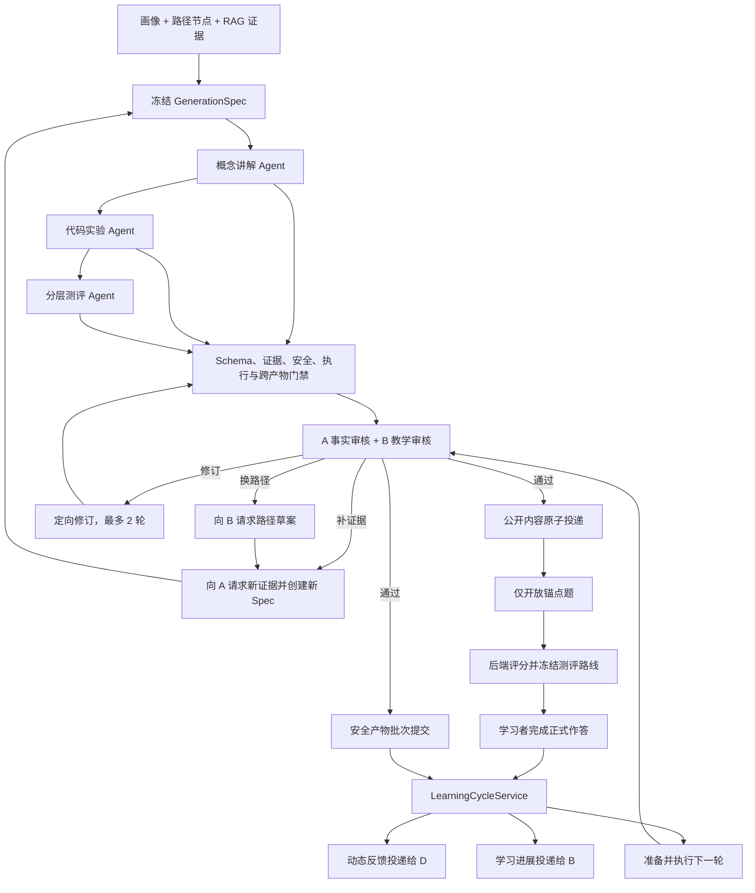

# Role C 内容生成与学习闭环设计

| 项目 | 内容 |
|---|---|
| 设计版本 | 3.5 |
| Schema 版本 | 1.0 |
| Prompt manifest | `c-prompts-1.16.2` |
| 实现目录 | `src/role-c-content/` |
| Schema 目录 | `schemas/role-c-content/` |
| 自动检查 | `bun run check` |
| Docker 验收 | `bun run test:role-c:docker` |

## 1. 职责与合同

Role C 将版本化画像、学习路径和 RAG 证据转换为相互对齐的概念讲义、代码实验和分层测评，并完成内容审核、可信评分、动态反馈、学习证据、掌握度更新和下一轮生成。

| 方向 | 正式合同 |
|---|---|
| A → C | `RagEvidencePack` |
| B → C | `LearnerProfileSnapshot`、`LearningPathNode`、`RoleBPathPlanningResult` |
| D → C | `SubmissionEnvelope` |
| C → A | `EvidenceGapRequest`、`FactAuditPacket` |
| C → B | `RoleBPathPlanningRequest`、`RoleCLearningProgressDelivery` |
| C → D | `RoleCReviewedReleaseDelivery`、`RoleCReviewRecoveryStatusDelivery`、`RoleCLearningSessionDelivery`、`RoleCDynamicFeedbackDelivery` |

学习会话由认证后端创建。题目答案、参考实现、隐藏测试、评分比较值、Beta 参数、幂等账本和 `secure://role-c/...` 引用均保存在后端。

## 2. 总体流程


```mermaid
flowchart TD
    I["画像 + 路径节点 + RAG 证据"] --> S["冻结 GenerationSpec"]
    S --> C1["概念讲解 Agent"]
    C1 --> C2["代码实验 Agent"]
    C2 --> C3["分层测评 Agent"]
    C1 --> V["Schema、证据、安全、执行与跨产物门禁"]
    C2 --> V
    C3 --> V
    V --> AB["A 事实审核 + B 教学审核"]
    AB -->|通过| SEC["安全产物批次提交"]
    AB -->|通过| PUB["公开内容原子投递"]
    AB -->|修订| REV["定向修订，最多 2 轮"]
    AB -->|补证据| EA["向 A 请求新证据并创建新 Spec"]
    AB -->|换路径| PB2["向 B 请求路径草案"]
    PB2 --> EA
    EA --> S
    REV --> V
    PUB --> AN["仅开放锚点题"]
    AN --> RT["后端评分并冻结测评路线"]
    RT --> SUB["学习者完成正式作答"]
    SUB --> LC["LearningCycleService"]
    SEC --> LC
    LC --> FD["动态反馈投递给 D"]
    LC --> PB["学习进展投递给 B"]
    LC --> NX["准备并执行下一轮"]
    NX --> AB
```

内容流水线状态为 `PLANNED → GENERATING → VALIDATING → READY/BLOCKED/FAILED`。学习提交状态为 `RECEIVED → SCORED → DECIDED → MASTERY_APPLIED → COMPLETED`，并包含 `BLOCKED` 和 `NEEDS_REVIEW` 终态。

## 3. 冻结输入

`buildGenerationSpec` 校验并冻结：

- 画像、路径和证据的完整内容哈希及版本；
- 目标、必要事实、先修关系和可观察行为；
- 难度向量、测评蓝图、资源限制和安全策略；
- Prompt、模型配置、Runner 镜像和随机 seed。

Locked Core 包含事实、目标、先修、代码语义、答案和评分规则。Adaptive Shell 包含解释顺序、案例语境、阅读密度、提示层级和脚手架。个性化参数只调整 Adaptive Shell。

RAG 无命中、弱匹配或材料不足时生成 `EvidenceGapRequest`；事实冲突时生成 `FactAuditPacket`。对应运行保持 `blocked`。

## 4. 三个内容 Agent

| Agent | 主要产物 | 核心门禁 |
|---|---|---|
| 概念讲解 `concept-tutor` | 先修桥梁、概念解释、示例、误区、即时检查、三级提示和目标映射 | 目标覆盖、事实引用、可见正文审核 |
| 代码实验 `code-lab` | public 任务、starter、公开测试、提示；secure 参考实现、隐藏测试和评分组 | public/secure 对齐、参考实现、Docker 执行、泄漏检查；mutation 仅记录可选质量指标 |
| 分层测评 `tiered-evaluator` | Tier 1/2/3 题面、稳定题目身份、secure AnswerSpec、rubric 和代码测试 | 蓝图覆盖、答案一致性、代码执行、选项与评分语义 |

三个 Agent 使用同一份递归冻结的 `GenerationSpec` 和证据包。模型生成候选内容，程序生成稳定 ID、题目计划、覆盖索引、评分聚合、质量指标和发布状态。

### 4.1 分阶段生成

| Agent | 调用阶段 |
|---|---|
| concept-tutor | 按目标组生成片段，再按目标顺序确定性聚合 |
| code-lab | 先冻结 public，再生成 secure |
| tiered-evaluator | 先冻结 item plan，再生成 public 和 secure |

每个阶段执行局部 Schema 与语义校验，聚合后执行完整门禁。该结构控制单次输出规模，并支持有界并发和定向修复。

### 4.2 下一轮语义

`next_round_context` 只影响内容重点和呈现：

- `focus_objective_ids` 优先讲解、练习和检查，全部冻结目标仍保持完整覆盖；
- `remediate` 增加步骤、示例和提示，降低无关认知负荷；
- `reinforce` 生成同难度的新情境或新变式；
- `advance` 使用新路径节点和新证据，历史反馈只影响重点与脚手架。

概念分段只接收本段包含的 focus 目标，防止跨目标误用补救指令。

## 5. 内容验证与 A/B 审核

C 内部门禁依次检查：

1. JSON Schema、状态语义和冻结输入身份；
2. Claim、引用和全部学习者可见正文的事实接地；
3. public/secure 分离和敏感值泄漏；
4. 参考实现、starter、公开测试和隐藏测试；可选错误变体只形成质量指标；
5. 测评题面、AnswerSpec、rubric 与代码测试；
6. 讲义、实验、测评之间的目标、难度和答案对齐。

确定性跨产物检查只处理目标映射、可执行性和答案一致性等结构问题，关键问题最多执行一次定向修订。可选模型 Critic 只输出诊断信息。随后，A 检查事实和引用，B 检查目标、先修、难度和教学适配。外部审核最多修订两轮，并始终使用同一份冻结输入。

审核请求和结果绑定 `pipeline_input_hash`、`generation_spec_hash`、`GenerationSpec.evidence_content_hash`、三份公开产物哈希、审核策略版本和修订序号。B 的结构化结果包含失败维度、缺失先修、未知先修引用、恢复动作、修复范围、建议难度和可恢复状态。

恢复动作如下：

| 修复范围 | C 的处理 |
|---|---|
| `artifact` | 在当前 Spec 内定向修订，最多两轮 |
| `new_evidence` | 向 A 请求指定知识点的新证据，验证覆盖后创建新 Spec 并重新生成、审核 |
| `new_spec` | 调用 B 路径规划，校验路径草案，向 A 取证并绑定事实后创建新 Spec |

每轮跨 Spec 恢复均记录输入、输出和 A/B 请求标识，最多两次。未知先修引用、无效 B 响应和不可支持目标返回结构化阻塞结果。

## 6. 发布与回执

审核通过后执行以下提交与发布：

1. `code_lab_secure` 与 `assessment_secure` 通过 `putBatch` 提交为一个安全存储批次；
2. 三份公开产物与 trace 组成 `RoleCReviewedReleaseDelivery`；
3. 初始锚点会话和路线冻结后的会话分别组成独立的 `RoleCLearningSessionDelivery`；
4. `BLOCKED`、`FAILED` 和 `UNSUPPORTED_TARGET` 组成 `RoleCReviewRecoveryStatusDelivery`。

学习完成后，动态反馈通过 `RoleCDynamicFeedbackDelivery` 投递给 D；学习证据和可选画像漂移建议通过 `RoleCLearningProgressDelivery` 投递给 B。

每个 envelope 包含稳定 `delivery_id`。审核发布身份绑定 Spec、审核结果、三份产物和 trace 语义，排除 trace 序号、时间和耗时等遥测字段；相同业务结果重新执行仍保持同一投递身份。接收方以该 ID 原子提交，并返回同 ID、同类型的 `accepted` 或 `duplicate` 回执。相同学习证据按 `event_id` 排序，因此输入顺序不影响投递身份。Reviewed release、恢复状态和学习会话使用独立投递身份，任一失败均可按原 ID 重试。

审核未通过的内容不能进入 reviewed release；其结构化状态通过恢复状态合同交给 D。

## 7. 代码执行与评分

Python 代码统一使用 `DockerPythonCodeRunner`：

- 使用本机解析后的不可变 image ID；
- 关闭网络，使用只读 root、非 root 用户和受限 tmpfs；
- 限制 CPU、内存、PIDs、执行时间和输出大小；
- 容器只接收学习者代码、测试输入和执行合同；
- 期望答案、测试权重、比较规则和计分保留在后端。

评分支持 exact-set、numeric、code 和 concept-rubric。主观题逐 criterion 盲审；存在 `uncertain` 或加权置信度低于 `0.65` 时返回 `NEEDS_REVIEW`。

## 8. 学习闭环

`LearningCycleService` 的正式流程：

1. 注册通过中央审核门禁的 `READY` 运行，并复核 public/secure 配对；
2. `openAnchorFirstSession` 创建仅包含锚点题的 `ANCHOR_PENDING` 会话；
3. `routeAssessmentAnchors` 从 secure store 读取答案并评分，以真实锚点得分选择路线，通过 revision CAS 冻结为 `ROUTE_LOCKED`；
4. 路线冻结后更新正式必答题集合；最终提交中的锚点答案必须与选路时一致；
5. 独立校验认证 learner 与 `SubmissionEnvelope.learner_id_hash`；
6. 从 secure store 读取答案和代码测试，冻结 `GradeResult`；
7. 生成 `LearningEvidenceEvent`，原子更新 Beta 掌握度；
8. 组装唯一公开结果 `DynamicFeedbackResult`；
9. 持久化完成状态，并按配置向 B 投递学习进展。

浏览器可调用的 `processSubmission` 只返回公开反馈或精简错误。学习证据、内部评分和 Beta 状态由后端入口 `processSubmissionInternal` 处理。

锚点阶段不生成学习证据、不更新掌握度。相同答案重放返回同一路线锁；不同答案并发时只有一个 revision CAS 可以冻结路线。D 保存锚点题集合并冻结对应输入，正式提交继续使用选路时的答案。

本轮动作规则：

| 条件 | 动作 |
|---|---|
| 正确率 `< 0.4` | `remediate` |
| `0.4 ≤` 正确率 `< 0.8` | `reinforce` |
| 正确率 `≥ 0.8` | `advance` |
| 明确画像漂移 | `reprofile` |

提示级别、重复曝光、grader confidence 和题目权重参与 evidence score 与长期掌握度更新。本轮动作、冻结成绩和全部学习证据使用同一 `final_decision`。

## 9. 下一轮执行

后端通过 `LearningCycleService.prepareNextRoundFromCompletedSubmission` 从持久化的
`COMPLETED` 提交读取冻结反馈、GenerationSpec 和证据，再调用纯规划函数
`prepareNextRound` 产生确定性请求：

| 动作 | 输入与调整 |
|---|---|
| `remediate` | 复用当前节点和蓝图，降低负荷并提高脚手架 |
| `reinforce` | 复用当前节点、难度和适配参数，生成新变式 |
| `advance` | 使用路径编排提供的新节点、对应证据和可选新画像 |
| `reprofile` | 生成画像漂移建议 |

`current_generation_versions` 可指定本轮 Prompt、模型和 Runner 版本，并纳入 request ID、run ID 和幂等身份。

`executePreparedNextRound` 绑定以下执行配置：

- 完整准备输入、反馈和决策，并复核准备阶段生成的幂等身份；
- 最大外部修订次数与 trace 起始序号；
- 审核策略和显式审核执行配置版本；
- secure store namespace。

相同执行身份由 single-flight 合并并发调用。审核通过的 `READY` 结果写入 `NextRoundExecutionJournal`，后续调用先校验中央审核门禁和两条 secure 引用，再顺序重放。失效的 secure 引用通过结果哈希 CAS 清除后重新生成；journal 提交结果不确定时清理本次安全批次并撤销同一记录。注入式 journal 的原子提交保留 winner，并清理 loser 的安全存储批次。

`continueCompletedLearningCycle` 将 B 的新版画像、路径和 A 的对应证据送入可恢复审核流水线。服务端入口 `continueRoleCAfterSubmission` 从持久化记录读取当前画像、冻结反馈和历史证据；D 提供 B 的新路径后，C 在服务端刷新 A 证据并绑定目标事实。最终通过后按顺序注册 run、创建稳定的锚点会话，再发布 reviewed release 与学习会话。锚点得分产生后由 `routeRoleCAssessmentAnchors` 调用可信评分并冻结正式测评路线。

本地开发/预览服务公开四个统一入口：

| 路径 | 服务入口 |
|---|---|
| `/api/role-c/generate` | `generateRoleCForRoleDWithRuntime` |
| `/api/role-c/run-code-lab` | `runRoleCCodeLab` |
| `/api/role-c/submit` | `submitRoleCAssessment` |
| `/api/role-c/continue` | `continueRoleCAfterSubmission` |
| `/api/role-c/route-anchors` | `routeRoleCAssessmentAnchors` |

`LearningRunRecord` 保存与 GenerationSpec 一致的可信画像快照，使下一轮在进程重启后仍能仅凭会话和提交标识恢复。继续执行和对外投递使用稳定身份记录，重复请求返回同一终局结果。

`RoleDGeneratedArtifact.lab` 提供实验说明、执行约定、初始代码、公开测试、分层提示和反思题；原有 `content` 保留为初始代码，兼容只读取字符串的调用方。D 调用 `run-code-lab` 时提交 `executionId`、会话/run/学习者/实验标识和学习者代码。C 从安全存储读取当前实验的隐藏测试并在 Docker 中执行，只返回通过数量、得分比例和公开反馈，不返回隐藏测试、参考实现或安全存储引用。

外层 `AdaptiveLearningLoopJournal` 记录恢复调用、生成结果、run/session 激活和对外投递阶段。`AtomicFileAdaptiveLearningLoopJournal` 使用完整性哈希、revision CAS、文件锁和私有文件权限支持跨进程、跨重启续跑。A/B 请求使用稳定请求标识；已成功响应、已发布结果和终态均可直接重放。

## 10. 持久化与部署

- 生成缓存键覆盖完整 Spec、证据、Prompt、模型配置和 seed；
- 基础 `runCPipeline` 可注入 cache、checkpoint 和 append-only trace store，相同执行身份的并发请求由 single-flight 合并；
- 自适应学习闭环部署时注入 `AtomicFileAdaptiveLearningLoopJournal`；执行身份绑定准备请求、恢复策略、审核配置、安全存储和 D 接收目标；
- JSONL trace store 使用文件锁串行读写，并在读取时复核 Schema、敏感信息和各 run 的严格递增序号；
- 学习周期记录使用内容哈希、revision CAS、租约和原子状态转换；
- 安全读取、Docker/模型评分和反馈生成期间按租期续约；失去 owner 后停止后续状态提交；
- 掌握度批次在全部 revision 校验通过后一次提交；
- 安全存储校验 principal、run、类型和内容完整性；
- 临时安全存储错误释放提交租约，确定性边界错误保存为终态。

`AtomicFileLearningCycleStore` 和 `AtomicFileMasteryStateStore` 面向单主机进程部署。多主机部署使用实现同一端口的事务型数据存储和分布式租约。

## 11. 主要入口

| 入口 | 用途 |
|---|---|
| `runReviewedCPipeline` | 生成、C 内部门禁、A/B 审核和安全产物提交 |
| `runRecoverableReviewedCPipeline` | 按结构化审核动作执行修订、补证据或换路径 |
| `createLocalBPathPlanningPort` | 将 B 本地路径规划器适配为 C 恢复接口 |
| `deliverRoleCToD` | 原子投递审核通过的公开内容与 trace |
| `deliverReviewRecoveryStatusToD` | 原子投递阻塞、失败或不支持目标状态 |
| `deliverLearningSessionToD` | 原子投递锚点待答或路线已冻结的会话 |
| `LearningCycleService` | 会话、提交、评分、证据、掌握度和动态反馈 |
| `LearningCycleService.openAnchorFirstSession` | 创建仅含锚点题的可信会话 |
| `LearningCycleService.routeAssessmentAnchors` | 可信评分锚点题并冻结正式路线 |
| `LearningCycleService.executePublishedCodeLab` | 校验会话身份并执行当前已发布代码实验 |
| `LearningCycleService.prepareNextRoundFromCompletedSubmission` | 从冻结的已完成提交准备可信下一轮 |
| `deliverDynamicFeedbackToD` | 原子投递统一动态反馈 |
| `deliverRoleCToB` | 原子投递学习进展和画像漂移建议 |
| `prepareNextRound` | 对可信冻结输入执行确定性下一轮规划 |
| `executePreparedNextRound` | 审核执行、并发合并和成功结果重放 |
| `continueCompletedLearningCycle` | 完成下一轮恢复审核、run/session 注册和 D 发布 |
| `continueRoleCAfterSubmission` | 服务端恢复已完成提交、刷新新路径证据并继续下一轮 |
| `routeRoleCAssessmentAnchors` | 服务端接收锚点答案并返回冻结后的正式路线 |
| `runRoleCCodeLab` | 向 D 提供公开、无答案泄漏的代码实验执行结果 |
| `RoleBLearningProgressAdapter` | B 接收学习证据信封、幂等更新画像并生成新版本 |

## 12. 验证命令

```bash
bun run typecheck
bun test --isolate ./tests
bun run demo:role-c
bun run demo:role-c:lab
bun run demo:role-c:full
bun run smoke:role-c:model
bun run docker:role-c:build
bun run docker:role-c:doctor
bun run test:role-c:docker
```

真实模型参数位于 Git 忽略的 `.env.role-c.local`。Docker 参数使用 `.env.role-c.example` 中的 `ROLE_C_DOCKER_*` 环境变量。

## 13. 完成状态

- 三个 Agent 的分阶段生成、确定性组合和完整门禁：已完成；
- public/secure 分离、Docker 执行和后端评分：已完成；
- A 事实审核、B 教学审核、定向修订及跨 Spec 恢复：已完成；
- 会话、提交、动态反馈、学习证据和掌握度更新：已完成；
- 四类下一轮准备、恢复审核、run/session 注册、持久化 journal 和终态重放：已完成；
- 锚点优先测评、得分选路、路线冻结和答案一致性校验：已完成；
- C 侧向 B/D 的原子幂等投递与下一轮会话登记：已完成；
- 画像版本、路径节点、目标包和完整评分合同校验：已完成；
- Schema、全量测试和 Docker 演示：已完成。
